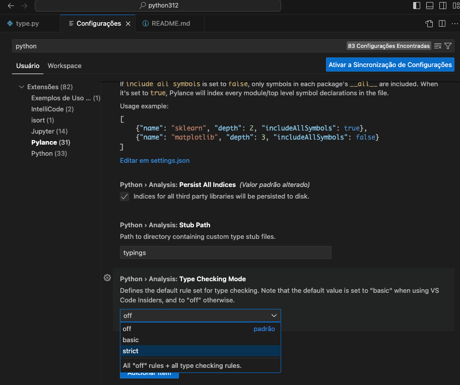
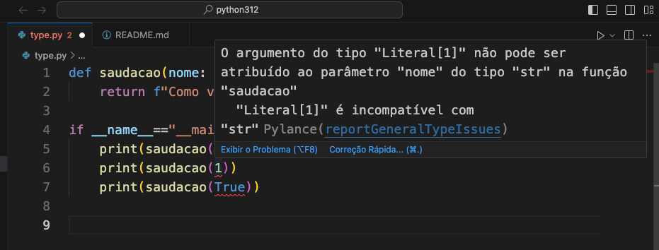
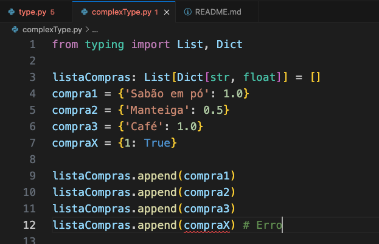
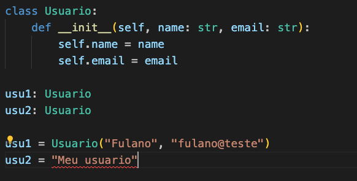
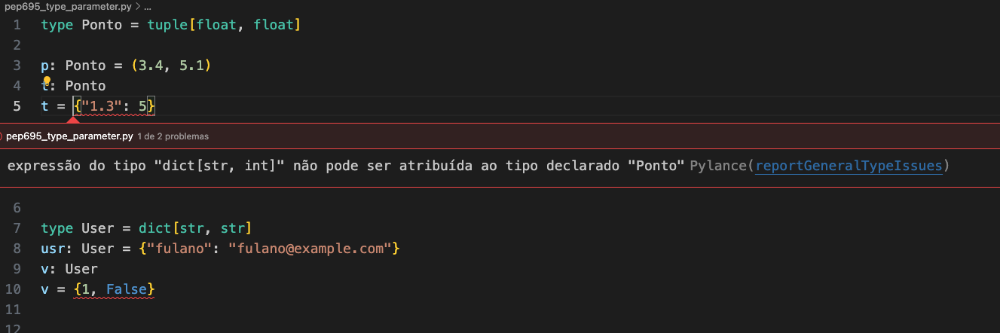
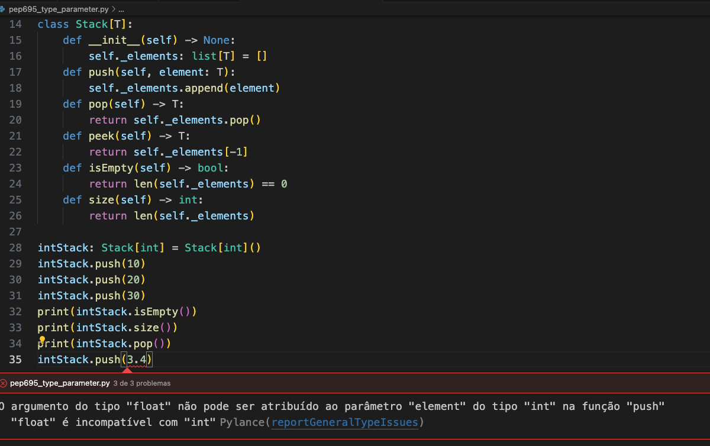

(c) 2023 [**Cleuton Sampaio**](https://github.com/cleuton), [**Linkedin**](http://linkedin.com/in/cleutonsampaio). Tem também o meu [**Canal no Youtube**](http://youtube.com/@CleutonSampaio) e os meus [**cursos na Udemy**](http://udemy.com/user/cleutonsampaio).

# Python Updates 4U

Então, saiu recentemente a versão ##3.12## do #Python com algumas novidades. De acordo com as release notes do [**Python Org**](https://docs.python.org/3.12/whatsnew/3.12.html): 

## Novas funcionalidades:

[**PEP 695**](https://docs.python.org/3.12/whatsnew/3.12.html#whatsnew312-pep695): Sintaxe de parâmetro de tipo e o comando "type".

## Melhorias na gramática:

[**PEP 701**](https://docs.python.org/3.12/whatsnew/3.12.html#whatsnew312-pep701): Nova gramática para expressar **f-strings**.

## Melhorias no interpretador:

- [**PEP 684**](https://docs.python.org/3.12/whatsnew/3.12.html#whatsnew312-pep684): Um [**GIL**](https://docs.python.org/3.12/glossary.html#term-global-interpreter-lock) por sub-interpretador para melhorar a concorrência em multicores.
- [**PEP 669**](https://docs.python.org/3.12/whatsnew/3.12.html#whatsnew312-pep669): Monitoração de baixo impacto.
- [**Sugestões**](https://docs.python.org/3.12/whatsnew/3.12.html#improved-error-messages) melhores para erros: NameError, ImportError e SyntaxError.

## Melhorias no modelo de dados: 

- [**PEP 688**](https://docs.python.org/3.12/whatsnew/3.12.html#whatsnew312-pep688): Utilizando o protocolo buffer a partir do Python

## Melhorias significativas na standard library:

- A classe **pathlib.Path** agora suporta subclasses.
- O módulo **os** recebeu diversas melhorias para suporte ao Windows.
- Uma interface de linha de comando foi adicionada ao módulo **sqlite3**.
- verificações **isinstance()** em protocolos verificáveis em tempo de execução desfrutam de um aumento de velocidade entre duas e 20 vezes.
- O pacote **asyncio** teve uma série de melhorias de desempenho, com alguns benchmarks mostrando uma aceleração de 75%.
- Uma interface de linha de comando foi adicionada ao módulo **uuid**.
- Devido às mudanças no **PEP 701**, a produção de tokens através do módulo **tokenize** é até 64% mais rápida.

## Melhorias de segurança: 

Substituiu as implementações hashlib integradas de **SHA1**, **SHA3**, **SHA2-384**, **SHA2-512** e **MD5** por código formalmente verificado do projeto [**HACL**](https://github.com/hacl-star/hacl-star/). Essas implementações integradas permanecem como substitutos que são usados apenas quando o OpenSSL não as fornecer.

## Melhorias na API C:

- [**PEP 697**](https://docs.python.org/3.12/whatsnew/3.12.html#whatsnew312-pep697): Nível de API C instável.
- [**PEP 683**](https://docs.python.org/3.12/whatsnew/3.12.html#whatsnew312-pep683): Objetos imortais.

## Melhorias na implementação do CPython:

- [**PEP 709**](https://docs.python.org/3.12/whatsnew/3.12.html#whatsnew312-pep709): Comprehension inlining.
- [**Suporte CPython**](https://docs.python.org/3.12/howto/perf_profiling.html#perf-profiling) para o profiler de desempenho do Linux
- Implementar proteção contra estouro de pilha em plataformas suportadas.

## Novos recursos de typing:

- [**PEP 692**](https://docs.python.org/3.12/whatsnew/3.12.html#whatsnew312-pep692), usando **TypedDict** para anotar **kwargs
- [**PEP 698**](https://docs.python.org/3.12/whatsnew/3.12.html#whatsnew312-pep698), decorador **typing.override()**.

## Deprecações, remoções ou restrições importantes:

- [**PEP 623**](https://peps.python.org/pep-0623/): Removeu **wstr** de objetos Unicode na API C do Python, reduzindo o tamanho de cada objeto **str** em pelo menos 8 bytes.
- [**PEP 632**](https://peps.python.org/pep-0632/): Removeu o pacote **distutils**. Consulte o guia de migração para obter conselhos sobre a substituição das APIs fornecidas. O pacote Setuptools de terceiros continua a fornecer distutils, se você ainda precisar dele no Python 3.12 e posteriores.
- [**gh-95299**](https://github.com/python/cpython/issues/95299): Não pré-instalar setuptools em ambientes virtuais criados com **venv**. Isso significa que **distutils**, **setuptools**, **pkg_resources** e **easy_install** não estarão mais disponíveis por padrão; para acessá-los, execute **pip install setuptools** no ambiente virtual ativado.
- Os módulos **asynchat**, **asyncore** e **imp** foram removidos, juntamente com vários aliases do método **unittest.TestCase**.

Mas o que exatamente significam essas coisas? Como isso te afeta? Essas são as perguntas que este tutorial quer responder. Para isto, vamos focar nas coisas que realmente impactarão a maioria dos projetos **Python**, deixando as outras para mais tarde. 

# Tipagem no Python: 

Desde a versão **3.5** o Python suporta [**type hints**](https://docs.python.org/3/library/typing.html). Mas o que isso significa exatamente? E por que estamos falando disso aqui, na versão **3.12**? 

```shell
>>> def hello(name: str) -> str: 
...     return f"Como vai, {name}"
... 
>>> a = hello("Fulano")
>>> print(a)
Como vai, Fulano
>>> print(hello(1))
Como vai, 1
>>> print(hello(True))
Como vai, True
>>> 
```

Declaramos uma função que recebe um parâmetro **string** (str) e retorna um valor **string** (-> str). Eu invoquei a função com um inteiro e com um valor lógico sem causar nenhum erro.

Na [documentação sobre **typing**](https://docs.python.org/3/library/typing.html) há uma observação importante: 

> O *runtime* do Python não impõe anotações de funções e tipos de variáveis. Eles podem ser usados por ferramentas de terceiros, como verificadores de tipo, IDEs, linters, etc.

Entendeu? Não? Bem, vou mostrar isso dentro do **VSCode** que costuma validar **python typing**. Para começar, você deve ter a extensão **Pylance** instalada, com **type checking habilidado**: 



Agora, você pode ver o **typing** em ação, pois o **Pylance** usará os **type hints** para validar seu código sem que você tenha que executá-lo: 



Você pode declarar variáveis com **type hints** e elas serão validadas por extensões como o **Pylance** ou linters como o **Pylint**. Vejamos alguns exemplos: 

```python
    varLogica: bool
    varInteira: int
    varReal: float

    varLogica = True
    varLogica = "Teste" # Erro

    varInteira = 10
    varInteira = 5.7 # Erro

    varReal = 10.6 
    varReal = 5
    varReal = "Real" # Erro
```

Podemos estender esse teste para tipos compostos, como: **list** e **dict**: 



Nós declaramos **listaCompras** como uma **List** que contém **Dict** com chave **str** e valor **float**, por isso que ele deu erro ao tentarmos adicionar a variável **compraX**.

E também funciona com classes declaradas pelo usuário: 



Se eu fosse você, começaria a utilizar **typing** com anotações em variáveis e parâmetros daqui para a frente, pois os **type hints** reduzem a possibilidade de erros de **runtime** mais difíceis de depurar. Você já fica sabendo antes de executar se tem algum problema no código. 

E porque estamos falando disso aqui? Porque há novidades no **typing** nesta versão e eu preciso que você saiba como funciona a tipagem no Python.


# Sintaxe de parâmetro de tipo

A **PEP 695** facilita a criação e parametrização de tipos e classes. Vejamos primeiramente a criação de tipos: 



Podemos criar nossos próprios tipos baseados em tipos do Python e usamos o **type hint** para validar isso. Porém, lembre-se: Essa validação é apenas para ferramentas como IDEs e Linters. Se tentar executar o script, ele vai rodar mesmo com os erros: 

```shell
python pep695_type_parameter.py
(3.4, 5.1) {'1.3': 5}
{'fulano': 'fulano@example.com'} {False, 1}
```

Agora, vejamos como criarmos classes parametrizadas, também conhecidas como "template" ou "generic" classes em outras linguagens: 



Como podem ver, criamos uma classe **Stack** parametrizável e uma instância dela que aceita **int** como elementos. Também podemos ver que a validação do **Pylance funciona perfeitamente com isso. 

# Melhorias na gramática:

A **PEP 701** melhorou o uso de f-strings. Por exemplo, nas versões anteriores do Python, este script daria erro: 

```python
user = {"id":5}
print(f"User Id: {user["id"]}")

Traceback (most recent call last):
  File "/tmp/main.py", line 2, in <module>
    import user_code
  File "/tmp/user_code.py", line 2
    print(f"User Id: {user["id"]}")
                            ^^
SyntaxError: f-string: unmatched '['

[Execution complete with exit code 1]
```

Agora, na versão 3.12, funciona sem problemas: 

```python
user = {"id":5}
print(f"User Id: {user["id"]}")

python fstrings.py                                             
User Id: 5
```

# Melhorias significativas na standard library:

Podemos destacar a console de linha de comando para o **sqlite3**, que permite executar queries e até entrar em um modo interativo: 
```shell
 % python -m sqlite3 testedb
sqlite3 shell, running on SQLite version 3.42.0
Connected to 'testedb'

Each command will be run using execute() on the cursor.
Type ".help" for more information; type ".quit" or CTRL-D to quit.
sqlite> create table User (
    ... id int primary key,
    ... name varchar(100)
    ... )
    ... ;
sqlite> insert into User (id, name) values ('100', 'Fulano');
sqlite> select * from User;
(100, 'Fulano')
sqlite> .quit
```

E também é possível gerar **uuid** diretamente da linha de comando: 
```shell
% python -m uuid
4a9ab0f9-a9b9-4e64-939e-f49c2c5922fe
```

# Novos recursos de typing:

Para você entender os efeitos da **PEP 692** (usando **TypedDict** para anotar "kwargs"), você precisa entender a anotação "kwargs", introduzida pela **PEP 484**. Veja o exemplo **kwargs.py**: 
```python
def calcular_preco(base: float, **kwargs: float) -> float: 
    valor: float = base
    if "desconto_vendedor" in kwargs:
        valor = valor - (valor * kwargs["desconto_vendedor"])
    if "desconto_loja" in kwargs:
        valor = valor - (valor * kwargs["desconto_loja"])
    return valor

print(calcular_preco(5000))
print(calcular_preco(5000, desconto_vendedor=0.05))
print(calcular_preco(5000, desconto_loja=0.1, desconto_vendedor=0.05))
```

A função **calcular_preco** recebe um valor base e pode receber zero ou mais parâmetros de descontos, cada um com seu nome específico. A anotação **kwargs** indica que os parâmetros serão colocados em um **dict[str, float]**, e é assim que eu passo esses parâmetros nas chamadas que fiz. Esse nome quer dizer **keyword arguments**. 

Com a mudança da **PEP 692** podemos utilizar classes nossas, derivadas de **TypedDict** para passarmos os parâmetros. Vejamos este exemplo no mesmo arquivo:
```python
from typing import TypedDict, Unpack
...
class Desconto(TypedDict):
    desconto_loja: float
    desconto_vendedor: float
    sobretaxa: float

def calcular_preco_2(base: float, **kwargs: Unpack[Desconto]) -> float: 
    valor: float = base
    valor = valor - (valor * kwargs["desconto_vendedor"])
    valor = valor - (valor * kwargs["desconto_loja"])
    valor = valor + (valor * kwargs["sobretaxa"])
    return valor
    
desconto: Desconto = {"desconto_loja": 0.1, "desconto_vendedor": 0.05, "sobretaxa": 0.0}
print(calcular_preco(5000,**desconto))
```